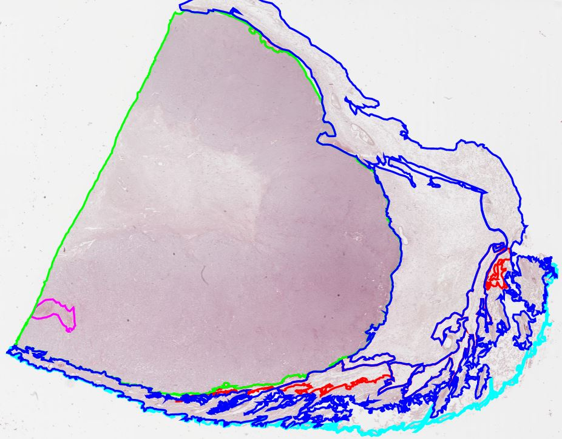
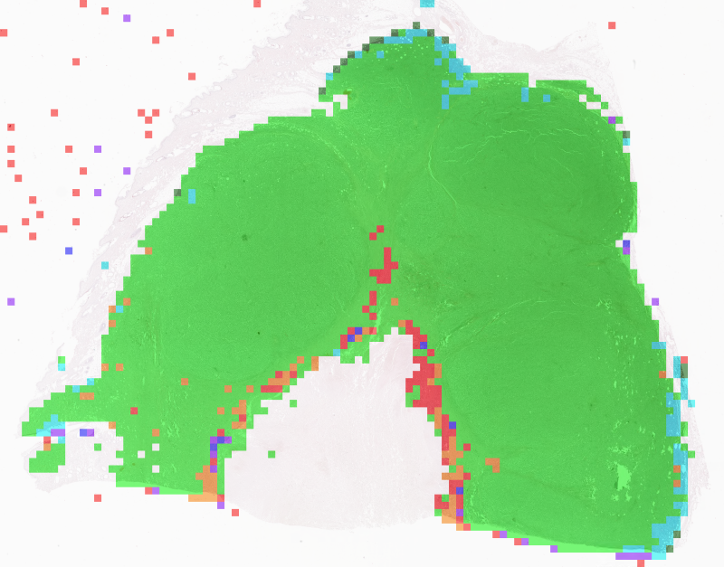

# CanineCutaneousTumors

This repository contains code examples for working with our publicly available dataset on microscopic whole slide images 
(WSIs) of canine cutaneous tumors. The dataset can be downloaded [here](https://www.cancerimagingarchive.net/collection/catch/) via the website of The Cancer Imaging Archive.

  

## Tissue Segmentation
We provide two Jupyter notebooks for training and applying a segmentation network to the dataset:
* Training: [segmentation_training.ipynb](segmentation/segmentation_training.ipynb)
* Inference: [segmentation_inference.ipynb](segmentation/segmentation_inference.ipynb)

## Tumor Classification
We provide two Jupyter notebooks for training and applying a classification network to the dataset:
* Training: [classification_training.ipynb](classification/classification_training.ipynb)
* Inference: [classification_inference.ipynb](classification/classification_inference.ipynb)

## Slide Inference
We provide a Jupyter notebook for WSI inference and performance evaluation:
* [slide_inference.ipynb](evaluation/slide_inference.ipynb) 

## Visualization
We provide two [SlideRunner](https://github.com/DeepPathology/SlideRunner) PlugIns for visualization of the [segmentation](plugins/wsi_segmentation.py) and 
[classification](plugins/wsi_classification.py) results.

  
   

## Pre-trained Models
We provide two pre-trained models for patch segmentation and classification. These can be found in the 
[models](models) folder. 
<!-- A detailed evaluation of these models can be found in our ScientificData paper:   
> Link to paper -->

## Annotation Conversion
We provide six python modules to convert various annotation formats into one another. These can be found in the 
[annotation_conversion](annotation_conversion) folder. 

  
